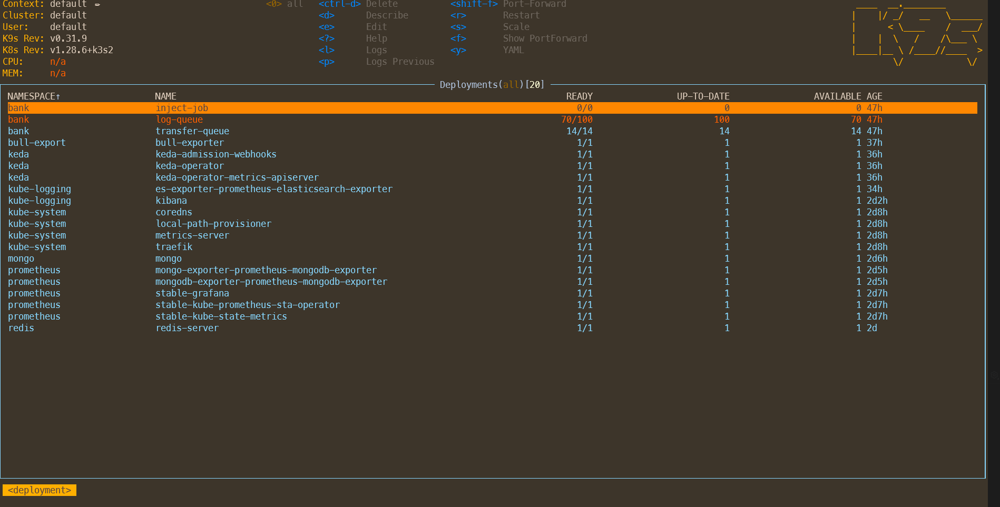
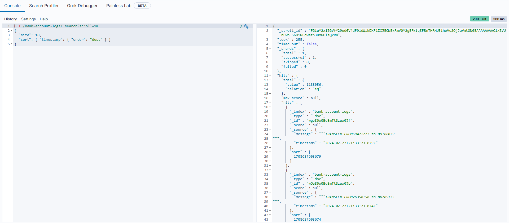
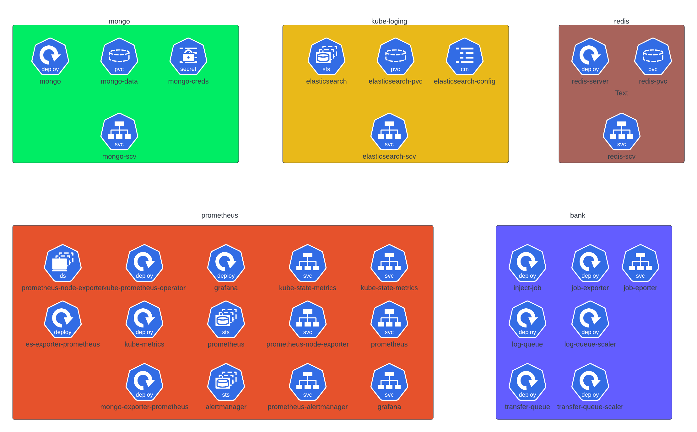

# Introduction

Dans le cadre de notre projet de déploiement d'une infrastructure microservices, nous avons choisi d'utiliser les technologies suivantes : Elasticsearch, MongoDB, Prometheus et Grafana. L'objectif de ce rapport est de présenter notre démarche et les étapes nécessaires pour mettre en place cette infrastructure sur Kubernetes en utilisant k3s.

Nous commencerons par expliquer brièvement les concepts clés liés aux microservices, à Kubernetes et à k3s. Ensuite, nous détaillerons les différentes étapes du déploiement, en mettant l'accent sur la configuration et l'installation de chaque composant. Nous aborderons également les bonnes pratiques de gestion des microservices, la surveillance avec Prometheus et l'analyse des données avec Grafana.

En conclusion, ce rapport fournira une vue d'ensemble complète du déploiement d'une infrastructure microservices avec Elasticsearch, MongoDB, Prometheus et Grafana sur Kubernetes à l'aide de k3s. Nous espérons que ce rapport sera une ressource précieuse pour ceux qui souhaitent se lancer dans ce type de déploiement.

# Overview de l'Architecture

Dans cette section, nous allons fournir un aperçu de l'architecture du système, en mettant l'accent sur les bases de données utilisées, les microservices de l'application, ainsi que la supervision mise en place.

## Bases de Données

Le système repose sur trois bases de données distinctes, chacune ayant un rôle spécifique:

- Redis: Utilisé comme système de stockage en mémoire pour des opérations rapides de mise en file d'attente des tâches.

- MongoDB: Employé comme base de données principale pour stocker les transactions et les données associées.

- Elasticsearch: Utilisé pour indexer et rechercher les transactions, fournissant une fonction de journalisation et de recherche rapide.

## Microservices de l'Application

Le système bancaire repose sur trois microservices qui forment un système de gestion de file d'attente pour les tâches:

- Service d'injection de transactions: Responsable de l'ajout de nouvelles transactions dans le système. Il communique avec Redis pour mettre en file d'attente les transactions à traiter.

- Service de traitement des transactions: Chargé du traitement des transactions en attente dans la file d'attente Redis. Il interagit avec MongoDB pour stocker les données transactionnelles.

- Service de journalisation des transactions: En charge de l'enregistrement des transactions dans Elasticsearch pour la journalisation et la recherche ultérieure.

## Supervision
La supervision du système est un élément crucial pour garantir la stabilité, la performance, et la disponibilité des services. Nous utilisons la stack Prometheus, une solution populaire dans le domaine de la supervision, pour collecter, stocker et alerter sur les métriques générées par les différents composants du système.

### Exporteurs Prometheus

Chaque composant critique du système est équipé d'un exporteur Prometheus dédié, permettant de recueillir des métriques spécifiques. Voici une brève explication de chaque exporteur:

Exporteur pour MongoDB: Collecte des métriques liées aux performances de MongoDB telles que les opérations de lecture/écriture, les temps de réponse, et les statistiques d'index.

Exporteur pour Redis: Fournit des métriques relatives à l'utilisation de Redis, comme le nombre de connexions, les opérations de lecture/écriture, et la mémoire utilisée.

Exporteur pour Elasticsearch: Rassemble des métriques essentielles telles que les indices, les requêtes, et les performances générales d'Elasticsearch.

Exporteur pour Kubernetes: Surveille l'état du cluster Kubernetes, collectant des métriques sur les nœuds, les pods, et d'autres ressources. 

### Grafana
Grafana joue un rôle central dans notre architecture en tant qu'outil puissant de visualisation et d'alerte. Intégré à notre projet, Grafana permet de transformer les données collectées par Prometheus en tableaux de bord interactifs, offrant une vue complète et en temps réel de notre infrastructure, y compris le cluster Kubernetes, les instances Elasticsearch, et les microservices.

#### Visualisation des Données
##### Supervision du Cluster Kubernetes

Grafana offre une représentation graphique détaillée de la santé et des performances de notre cluster Kubernetes. Les tableaux de bord Kubernetes personnalisés permettent de surveiller la capacité, l'utilisation des ressources, et l'état opérationnel de chaque nœud et pod.

##### Instant Elasticsearch

Les données d'Elasticsearch sont visualisées de manière claire et intuitive dans Grafana. Les tableaux de bord spécifiques à Elasticsearch permettent de suivre les indices, les requêtes, et les performances, offrant une visibilité complète sur l'état de notre moteur de recherche.

##### Microservices

Chaque microservice est représenté dans Grafana avec des tableaux de bord dédiés. Cela permet de surveiller les métriques spécifiques à chaque service, d'identifier les tendances, et de diagnostiquer rapidement tout problème potentiel.

#### Alerte et Gestion des Incidents
Grafana n'est pas seulement un outil de visualisation, mais également un moteur d'alerte avancé. Grâce à l'intégration avec Prometheus, nous pouvons définir des règles d'alerte personnalisées basées sur les métriques collectées. En cas de détection d'anomalies ou de situations critiques, Grafana déclenche des alertes en temps réel.


# Infrastructure Kubernetes
L'infrastructure Kubernetes joue un rôle central dans le déploiement et la gestion de nos microservices. Nous avons opté pour une machine virtuelle sur Azure Cloud avec des spécifications matérielles adaptées à nos besoins, soit 16 Go de RAM et 4 cœurs. Sur cette infrastructure, nous avons déployé k3s, une distribution légère de Kubernetes, pour orchestrer nos conteneurs.

## Spécifications de la Machine Virtuelle (VM) Azure
- Type de Machine Virtuelle : Standard_D4s_v3
- RAM : 16 Go
- Cœurs : 4
- Système d'Exploitation : Ubuntu 20.04

## Déploiement de k3s
K3s est une distribution Kubernetes simplifiée, légère et conçue pour être facile à installer et à gérer, tout en conservant la puissance de Kubernetes. Voici un exemple de la procédure d'installation de k3s sur la machine virtuelle Azure:

```bash
# Installation de k3s sur la machine virtuelle
curl -sfL https://get.k3s.io | sh -

# Vérification de l'état du cluster
kubectl get nodes
```

## Avantages de k3s
- Légèreté : K3s est conçu pour être léger, ce qui le rend adapté à des environnements avec des ressources limitées comme notre VM Azure.
- Simplicité d'Installation : L'installation simplifiée de k3s permet de déployer rapidement un cluster Kubernetes opérationnel.
- Gestion Facile : K3s inclut une gestion simplifiée du cluster, avec moins de dépendances, facilitant ainsi la maintenance.
- Compatibilité Kubernetes : Bien qu'allégée, K3s reste compatible avec les API Kubernetes standard, offrant une compatibilité totale avec l'écosystème Kubernetes.

## Kubectl et K9s 
### Kubectl
kubectl est l'outil de ligne de commande officiel de Kubernetes, permettant aux administrateurs et aux développeurs d'interagir avec le cluster. kubectl offre une flexibilité totale pour gérer toutes les ressources Kubernetes, et son utilisation est cruciale pour le déploiement et la maintenance de nos microservices.

### k9s
k9s est une interface utilisateur en mode texte pour Kubernetes, offrant une visualisation interactive et une gestion simplifiée des ressources du cluster. Voici quelques fonctionnalités clés de k9s :
- Interface conviviale en mode console : Fournit une vue en mode texte facile à utiliser pour naviguer dans les ressources Kubernetes.

- Visualisation en temps réel : Affiche en temps réel les modifications apportées aux ressources, facilitant le suivi des opérations.

- Interactivité : Permet d'effectuer des actions directement depuis l'interface, comme le redémarrage de pods ou l'affichage des journaux.

- Recherche facilitée : Possède des fonctionnalités de recherche avancées pour localiser rapidement des ressources spécifiques.



# Deployement

## Mongo Db
### Deployement
Le déploiement définit la configuration du pod MongoDB, y compris le nombre de réplicas, les stratégies de déploiement, et les spécifications du conteneur.

- Replicas : Un seul pod MongoDB est déployé, défini par la spécification replicas: 1.

- Conteneur MongoDB : Le conteneur MongoDB utilise l'image officielle de MongoDB et est configuré avec les arguments --dbpath /data/db. Les variables d'environnement MONGO_INITDB_ROOT_USERNAME et MONGO_INITDB_ROOT_PASSWORD sont utilisées pour définir le nom d'utilisateur et le mot de passe du superutilisateur MongoDB, récupérés depuis un secret.

- Volume Persistent (Persistent Volume) : Un volume persistant nommé "mongo-data-dir" est monté à l'emplacement "/data/db" dans le conteneur MongoDB. Il est lié à une réclamation de volume persistant (Persistent Volume Claim) nommée "pvc-mongo". Ce volume persistant utilise une ressource de stockage de 1 Gi.

### Persistent Volume Claim
La réclamation de volume persistant spécifie les exigences de stockage pour le volume persistant utilisé par MongoDB.
- Stockage : Une réclamation de 1 Gi est faite, indiquant la quantité de stockage nécessaire.
- Mode d'Accès : La réclamation indique un mode d'accès de type "ReadWriteOnce", ce qui signifie qu'elle ne peut être montée que par un seul nœud en lecture-écriture.

### Service
Le service expose le déploiement MongoDB au sein du cluster Kubernetes. Il utilise le type "LoadBalancer" pour permettre un accès externe.
- Port : Le service expose le port 27017, le port par défaut de MongoDB.
- NodePort : Un port spécifique du nœud, le port 32000, est assigné pour permettre l'accès externe au service.
- Type de Service : Le type "LoadBalancer" est utilisé, ce qui permet la création d'un équilibreur de charge externe pour le service.

## Redis 
### Deployment
Le déploiement définit la configuration du pod Redis, y compris le nombre de réplicas, les spécifications du conteneur, et les volumes.
- Replicas : Un seul pod Redis est déployé, défini par la spécification replicas: 1.
- Conteneur Redis : Le conteneur Redis utilise l'image officielle de Redis et est configuré avec l'argument --appendonly yes pour activer la persistance des données. La variable d'environnement ALLOW_EMPTY_PASSWORD est définie à "yes", autorisant l'utilisation d'un mot de passe vide. Le conteneur expose le port 6379.
- Volume Persistant (Persistent Volume) : Un volume persistant nommé "lv-storage" est monté à l'emplacement "/data" dans le conteneur Redis. Il est lié à une réclamation de volume persistant (Persistent Volume Claim) nommée "redis-pvc". Ce volume persistant utilise une ressource de stockage de 1 Gi.

### Persistent Volume Claim
La réclamation de volume persistant spécifie les exigences de stockage pour le volume persistant utilisé par Redis.
- Stockage : Une réclamation de 1 Gi est faite, indiquant la quantité de stockage nécessaire.
- Mode d'Accès : La réclamation indique un mode d'accès de type "ReadWriteOnce", ce qui signifie qu'elle ne peut être montée que par un seul nœud en lecture-écriture.

### Service
Le service expose le déploiement Redis au sein du cluster Kubernetes. Il utilise le type "LoadBalancer" pour permettre un accès externe.

- Sélecteur : Le service sélectionne les pods avec l'étiquette app: redis-server.
- Type de Service : Le type "LoadBalancer" est utilisé, ce qui permet la création d'un équilibreur de charge externe pour le service.
- Ports : Le service expose le port 6379, le port par défaut de Redis.

## Elastic Search

### StatefulSet
Le StatefulSet définit la configuration du pod Elasticsearch, y compris le nombre de réplicas, les spécifications du conteneur, les volumes, et les configurations.

- Nom du StatefulSet: Le StatefulSet est nommé "elasticsearch" dans l'espace de noms "kube-logging".

- ServiceName: Spécifie le nom du service associé à ce StatefulSet.

- Replicas: Un seul pod Elasticsearch est déployé, défini par la spécification replicas: 1.

- Conteneur Elasticsearch: Le conteneur Elasticsearch utilise l'image officielle de Elasticsearch 7.12.0 et est configuré avec divers paramètres, notamment la découverte en tant que nœud unique.

- Volume Persistant (Persistent Volume): Un volume persistant nommé "elasticsearch-data" est monté à l'emplacement "/usr/share/elasticsearch/data" dans le conteneur Elasticsearch. Il est lié à une réclamation de volume persistant (Persistent Volume Claim) nommée "elasticsearch-pvc".

- Limite de Ressources: Des limites de ressources sont définies pour le CPU (500m) et la mémoire (4Gi).

- Contexte de Sécurité: Le contexte de sécurité permet à un utilisateur non root d'accéder au PersistentVolume.

### Persistent Volume Claim
La réclamation de volume persistant spécifie les exigences de stockage pour le volume persistant utilisé par Elasticsearch.

- Stockage : Une réclamation de 1 Gi est faite, indiquant la quantité de stockage nécessaire.

- Mode d'Accès : La réclamation indique un mode d'accès de type "ReadWriteOnce", ce qui signifie qu'elle ne peut être montée que par un seul nœud en lecture-écriture.

### Service
Le service expose Elasticsearch au sein du cluster Kubernetes. Il utilise le type "NodePort" pour permettre un accès externe.
- Nom du Service : Le service est nommé "elasticsearch" dans l'espace de noms "kube-logging".
- Type de Service : Le type "NodePort" est utilisé, ce qui permet à Elasticsearch d'être accessible depuis l'extérieur du cluster.
- Sélecteur : Le service sélectionne les pods avec l'étiquette component: elasticsearch.
- Ports : Le service expose le port 9200, le port par défaut d'Elasticsearch.

## Kibana
### Deployment
Le déploiement définit la configuration du pod Kibana, y compris les spécifications du conteneur, les variables d'environnement, les ports, et la référence à une ConfigMap.
- Nom du Déploiement : Le déploiement est nommé "kibana" dans l'espace de noms "kube-logging".
- Sélecteur : Le sélecteur matchLabels permet au déploiement de sélectionner les pods avec l'étiquette component: kibana.
- Conteneur Kibana : Le conteneur Kibana utilise l'image officielle de Kibana 7.12.0. Il est configuré avec plusieurs variables d'environnement, y compris l'URL d'Elasticsearch, l'activation de la sécurité X-Pack, et les informations d'identification Elasticsearch récupérées depuis une ConfigMap.
- Ports : Le conteneur expose le port 5601, le port par défaut de Kibana.

### Service
Le service expose le pod Kibana au sein du cluster Kubernetes. Il utilise le type "NodePort" pour permettre un accès externe.
- Nom du Service : Le service est nommé "kibana" dans l'espace de noms "kube-logging".
- Type de Service : Le type "NodePort" est utilisé, ce qui permet à Kibana d'être accessible depuis l'extérieur du cluster.
- Sélecteur : Le service sélectionne les pods avec l'étiquette component: kibana.
- Ports : Le service expose le port 5601, le port par défaut de Kibana.

### ConfigMap
La ConfigMap "kibana-config" contient les informations d'identification Elasticsearch utilisées par Kibana.
- elasticsearch_username : Nom d'utilisateur Elasticsearch (dans cet exemple, "elastic").
- elasticsearch_password : Mot de passe Elasticsearch (dans cet exemple, "eaHmnvrTaKRuv23sye1K").

Ce déploiement permet d'avoir un Kibana opérationnel, avec un accès externe possible via le port 5601.


# Deployement diagram


# Deployment usecases
Notre projet repose sur trois microservices interconnectés, chacun jouant un rôle spécifique dans le traitement des transactions. Ces microservices utilisent une architecture de file d'attente pour garantir un traitement asynchrone et efficace des tâches. Nous allons explorer chaque microservice individuellement, en mettant l'accent sur leur fonctionnement, leur interaction, et les mécanismes de surveillance mis en place.

## Microservice d'Injection dans Redis
Le premier microservice est responsable de l'injection initiale des transactions dans la base de données Redis. Cette étape initiale déclenche le processus de traitement asynchrone.

## Microservice de Traitement et Insertion dans MongoDB
Le deuxième microservice récupère les transactions depuis Redis et les insère dans la base de données MongoDB.

## Microservice de Journalisation dans Elasticsearch
Le troisième microservice récupère les transactions depuis Redis et génère des journaux qu'il insère dans Elasticsearch.

## Mise en Place de l'Auto-Scaling pour les Services
Pour optimiser la gestion des charges de travail et assurer une utilisation efficace des ressources, nous avons mis en œuvre un mécanisme d'auto-scaling spécifique à chaque microservice. Cela permet d'ajuster dynamiquement le nombre de répliques en fonction du nombre d'éléments en attente dans la file d'attente Redis associée à chaque microservice. Cette approche s'inscrit dans notre volonté d'assurer une réactivité optimale à la fluctuation de la charge de travail.

### Fonctionnement de l'Auto-Scaling
L'auto-scaling est mis en œuvre à l'aide de fonctionnalités spécifiques à la plateforme Kubernetes, permettant une gestion automatisée du nombre de répliques en fonction des métriques spécifiées. Dans notre cas, le critère principal est le nombre d'éléments présents dans la file d'attente Redis pour chaque microservice.

Pour chaque microservice, nous avons configuré les métriques suivantes pour déclencher l'auto-scaling:

- Métrique de File d'Attente : Le nombre d'éléments en attente dans la file d'attente Redis associée au microservice.
- Politique d'Auto-Scaling : Nous avons défini des politiques d'auto-scaling pour chaque microservice, basées sur les métriques configurées. Ces politiques spécifient les actions à entreprendre en cas de dépassement des seuils définis, que ce soit pour l'augmentation ou la diminution du nombre de répliques.

# Intégration avec Prometheus et Grafana
Chaque composant clé de notre projet est étroitement intégré avec Prometheus et Grafana, fournissant une surveillance approfondie, des alertes proactives, et des tableaux de bord visuellement riches. Cette intégration garantit une visibilité totale sur la santé, les performances, et les opérations de notre infrastructure.

## Microservices - Q Bull Queue Exporter
Pour les microservices utilisant la file d'attente Q Bull, nous avons déployé un exportateur Prometheus dédié qui extrait des métriques importantes liées à la file d'attente. Ces métriques comprennent la longueur de la file d'attente, le nombre de tâches réussies/échouées, et d'autres indicateurs clés.

### Composants d'Intégration :
- Exporter Q Bull Queue : Collecte et expose des métriques liées à la file d'attente Q Bull.

- Tableau de Bord Grafana : Un tableau de bord personnalisé offre une visualisation en temps réel de la longueur de la file d'attente, des performances, et des statistiques d'exécution des tâches.

- Alertes : Des règles d'alerte sont configurées pour détecter des anomalies telles que des files d'attente trop longues ou un nombre élevé de tâches échouées, déclenchant des alertes immédiates.

## ElasticSearch - Exporter et Service Discovery
Pour ElasticSearch, nous avons déployé un exportateur Prometheus dédié et un mécanisme de découverte de service pour exposer des métriques cruciales, y compris le nombre de documents dans un index, le temps de réponse des requêtes, et l'utilisation des ressources JVM.

### Composants d'Intégration :
- Exporter ElasticSearch : Collecte des métriques spécifiques d'ElasticSearch et les expose à Prometheus.

- Service Discovery : Permet la découverte automatique des instances ElasticSearch pour garantir une mise à jour dynamique des métriques en fonction du nombre d'instances.

- Tableau de Bord Grafana : Un tableau de bord dédié offre une vue approfondie des métriques d'ElasticSearch, facilitant la surveillance de la santé et des performances.

## K3S (Kubernetes Distribution) - Exportateurs et Alerts
Dans notre infrastructure K3S, chaque nœud dispose d'un ensemble d'exportateurs Prometheus en tant que démon défini pour collecter des métriques spécifiques au nœud, tandis que sur le nœud maître, un déploiement assure la collecte des métriques du cluster.

### Composants d'Intégration :
- Exportateurs Node et Cluster : Collectent des métriques spécifiques au nœud et au cluster Kubernetes, respectivement.

- Tableau de Bord Grafana : Des tableaux de bord distincts présentent les métriques du nœud et du cluster, offrant une vue holistique de la santé et des performances.

- Alertes : Des alertes sont configurées pour des scénarios critiques tels qu'une utilisation élevée du CPU, déclenchant des notifications via des webhooks Discord pour une réponse immédiate.

Cette intégration étendue avec Prometheus et Grafana nous fournit une plateforme centralisée et puissante pour la surveillance, la détection d'anomalies, et la réaction proactive à toutes les facettes de notre infrastructure, garantissant ainsi un environnement opérationnel robuste et hautement performant.